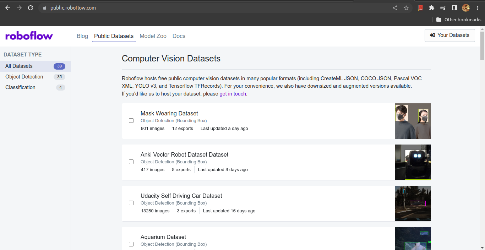
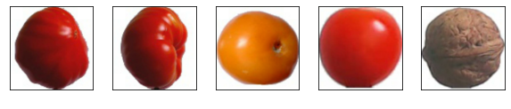
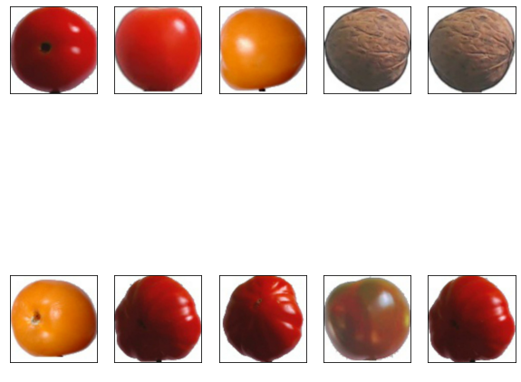

# Create an Image Classification model in a 3 simple steps using TFLite Model Maker.

Image classification is one of the most used cases when we think about Artificial Intelligence, Machine Learning, or Deep Learning. There are many ways to develop an Image Classification model, like Pytorch, Tensorflow, Fastai, etc. A less famous framework on top of Tensorflow is TFLite Model Maker, developed by Google.

In this blog post, I will guide you step-by-step to develop an Image Classification model using TFLite Model Maker. You can read more about it [here](https://www.tensorflow.org/lite/api_docs/python/tflite_model_maker).

[Youtube video](https://youtu.be/oy0kiszYcw0).

## Requirements
---
To follow this blog end-to-end, you need to set up a new environment on your computer. However, it is not compulsory to use your local machine, you can train a model on, let's say [Google Colab](https://research.google.com/colaboratory/) and download the trained model to server the requests for classification [it is out of the scope for this blog, maybe in my next blog I will cover this].

```
NOTE - it is not compulsory but if you can use VS Code to write and run the code, it will be very easy.
```

### Create a virtual environment

[1] open terminal[linux or mac] or cmd tool[windows] navigate to the directory where you want to keep the project files and run

> `python3 -m venv tutorial-env`

here, `tutorial-env` is the name of the virtual environment.

You can get more help [here](https://docs.python.org/3/tutorial/venv.html).

[2] once the virtual environment is created, activate the virtual environment by running

> on windowns run `tutorial-env\Scripts\activate.bat`

> on mac/linux run `source tutorial-env/bin/activate`

### Install required packages

Once the virtual environment is activated run the following command to get the required packages...

> `pip install tflite-model-maker matplotlib numpy ipykernel`

```
NOTE - this will take some time to complete, and depends on your laptop or pc and connection speed.
```

### Get the Dataset

In any machine learning or deep learning work, a dataset is as important as choosing the right model. There are again many ways to get the dataset, [Kaggle](https://www.kaggle.com/) is one of the most famous sources of the dataset. However, in this blog, I am going to show you a not much famous way to get a dataset. It is [Roboflow](https://public.roboflow.com/), you need to open an account with Roboflow, and it is a simple process.

Once you login into `Roboflow` you will see the following screen.

|  |
|:--:|
| **Raj Kapadia** |

You can download any Image classification dataset, I am going to use [Fruit Dataset](https://public.roboflow.com/classification/fruits-dataset) for this blog. Download it on your local machine, otherwise, you can also download it on a Google Colab notebook by the link they give you.

Once you download the dataset extract it into the folder where you want to write the code and create a new file `train_model.ipynb` and let's start writing the code.

## Develop a model
---
Now we are ready to start the training. Let's import the required packages before we start the training process

```python
    from typing import Tuple
    from tflite_model_maker.image_classifier import DataLoader
    from tflite_model_maker import image_classifier
    import tensorflow as tf
    import numpy as np

    import matplotlib.pyplot as plt
    %matplotlib inline
```

The `DataLoader` class is helpful to load the data from the folder path, and `image_classifier` will create the model and train it. You will wonder why I have imported a package from `typing`, you will find it out in a while...

### Create dataloader

Let's load the data, not into the memory, but differently, load it to the memory when you need it kind of a way.

```python
   data = DataLoader.from_folder('Fruits_Dataset/train')
   train_data, rest_data = data.split(0.8)
   validation_data, test_data = rest_data.split(0.5)
```
Provide the path where you see only the different class folders. We will split the data into three parts, 80% training, 10% validation, and the remaining 10% testing.

### Visualise the data

Now, let's see what our data look like...

```python
    plt.figure(figsize=(10, 10))
    for i, (image, label) in enumerate(data.gen_dataset().unbatch().take(5)):
        plt.subplot(5, 5, i+1)
        plt.xticks([])
        plt.yticks([])
        plt.grid(False)
        plt.imshow(image.numpy(), cmap=plt.cm.gray)
        plt.xlabel(data.index_to_label[label.numpy()], color='white')
    plt.show()
```
It will look something like this...

|  |
|:--:|
| **Raj Kapadia** |

We have 6 different classes to classify.

1. Tomato_3
2. Tomato_4
3. Tomato_Yellow
4. Tomato_Cherry_Red
5. Tomato_Maroon
6. Walnut

### Train the model

Training a model with the TFLite Model Maker library is piece of cake and this is the best thing about the library. You write only one line of code and it's done. Here is how you can do it as well.

```python
    model = image_classifier.create(
        train_data,
        model_spec='efficientnet_lite0',
        epochs=5,
        validation_data=validation_data
    )
```
This piece of code is self-explanatory but still, man this is a blog,

* the first argument is the dataset.
* second is the model, at this point in time TFLite Model Maker supports `EfficientNetLite0-4`, `MobileNet`, and `Resnet50`, you can choose one of them and you can read more about it [here](https://www.tensorflow.org/lite/api_docs/python/tflite_model_maker/image_classifier/EfficientNetLite0Spec).
* numbers of epochs, keep this a small number for testing the library then, once you got the idea, you can train your model for a longer period of time.
* provide the validation data to validate the model during the training period.

```
NOTE - there are two more arguments that I must explain here, one train_whole_model, in case you want to train the whole model, and the second use_augmentation, if you have a small number of samples for training, then you should use this.
```
The training time will depend on the hardware configuration and number of samples but for this Fruit Dataset roughly it will take 10 minutes on my 5 years old laptop.

### Test the model

Now let's test the performance of the model...

```python
    loss, accuracy = model.evaluate(test_data)
    predicts = model.predict_top_k(test_data, k=2)
```
Also, in order to visualize the performance of the model, we will run the following piece of code.

```python
    def get_label_color(val1, val2):
        if val1 == val2:
            return 'white'
        else:
            return 'red'

    plt.figure(figsize=(10, 10))

    for i, (image, label) in enumerate(test_data.gen_dataset().unbatch().take(10)):
        ax = plt.subplot(2, 5, i+1)
        plt.xticks([])
        plt.yticks([])
        plt.grid(False)
        plt.imshow(image.numpy(), cmap=plt.cm.gray)
        predict_label = predicts[i][0][0]
        color = get_label_color(predict_label,
                                test_data.index_to_label[label.numpy()])
        ax.xaxis.label.set_color(color)
        plt.xlabel(predict_label)
    plt.show()
```
This will generate a plot like this... It will show you a label in red color in case the predictions is wrong.

|  |
|:--:|
| **Raj Kapadia** |

### Save the model

The trained model can be saved on your local computer, even this lite model can be transferred to mobile devices, just run the following piece of code.

```python
    model.export(
        export_dir='.',
        tflite_filename='fruit_classifier.tflite'
    )
```
the parameter `export_dir` is the path where you want to save the model, and `tflite_filename` is the name of the model file, make sure the model has an extension of `.tflite`

### Prediction on a single image

I have seen this in almost every blog on the internet, they show everything except one thing, how to get the prediction for a single image, you don't have to worry anymore, I will show it for sure, so here you go.

```python
    MODEL_PATH = 'fruit_classifier.tflite'

    def get_interpreter(model_path: str) -> Tuple:
        interpreter = tf.lite.Interpreter(model_path=model_path)
        interpreter.allocate_tensors()

        input_details = interpreter.get_input_details()
        output_details = interpreter.get_output_details()
        
        return interpreter, input_details, output_details

    def predict(image_path: str) -> int:
        interpreter, input_details, output_details = get_interpreter(MODEL_PATH)
        input_shape = input_details[0]['shape']
        img = tf.io.read_file(image_path)
        img = tf.io.decode_image(img, channels=3)
        img = tf.image.resize(img, (input_shape[2], input_shape[2]))
        img = tf.expand_dims(img, axis=0)
        resized_img = tf.cast(img, dtype=tf.uint8)
        
        interpreter.set_tensor(input_details[0]['index'], resized_img)
        interpreter.invoke()

        output_data = interpreter.get_tensor(output_details[0]['index'])
        results = np.squeeze(output_data)
        return np.argmax(results, axis=0)
```
If you see the above code you will find that why I have imported `Tuple` from `typing` module, yes, I have written all the code with the latest function writing techniques.

The function `get_interpreter` returns the `interpreter`, it a fancy word for `model` and some input and output details to get ready the image for testing and prediction.

The second function `predict` will take the image path and returns the `label`

### Now where?

The code explained here in this blog can be replicated for any image classification problem.

### Where is the code?

The code used in this blog can be downloaded from my [Github](https://github.com/RajKKapadia/TFLite-Model-Maker-Image-Classification-Blog).

## About me
---
I am `Raj Kapadia`, I am passionate about `AI/ML/DL` and their use in different domains, I also love to build `chatbots` using `Google Dialogflow`. For any work, you can reach out to me at...

* [LinkedIn](https://www.linkedin.com/in/rajkkapadia/)
* [Fiverr](https://www.fiverr.com/rajkkapadia​)
* [Upwork](https://www.upwork.com/freelancers/~0176aeacfcff7f1fc2)
* [Youtube](https://www.youtube.com/channel/UCOT01XvBSj12xQsANtTeAcQ)
